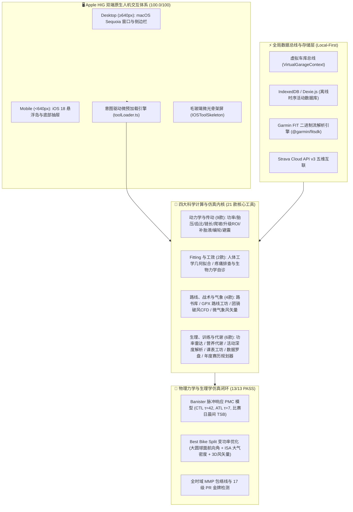

# Rouleur Pro 🚴‍♂️⚡
### Modern Precision Cycling Science & Performance Platform
#### 现代专业数据驱动骑行科学与全息性能平台

[](https://www.typescriptlang.org/)
[](https://reactjs.org/)
[](https://vitejs.dev/)
[](https://tailwindcss.com/)
[](https://developer.apple.com/design/human-interface-guidelines)
[]()
[]()
[]()
[](https://www.strava.com)
[]()
[]()
[]()
[]()
[](LICENSE)

---

## 📖 Introduction / 项目简介

**Rouleur Pro** is a modern, high-precision, client-side cycling engineering and endurance sports physiology operating system. Built upon classical aerodynamics, Newton mechanics, wheel trigonometry, biomechanics, and modern exercise physiology (Coggan, Banister, Seiler, Bompa & Friel), it equips amateur riders, bike fitters, mechanics, and competitive athletes with **21 purpose-built scientific calculation and simulation engines**.

**Rouleur Pro** 是一个现代化、纯前端高精度运行的专业公路车运动科学与工程数据计算站。以流体空气动力学、经典牛顿力学、轮圈几何空间三角学、人体工效学与现代耐力运动生理学（Coggan、Banister、Seiler、Bompa 与 Friel 理论）为数学底层，提供 **21 款严谨的计算器与仿真模拟工坊**，涵盖空气动力学推导、时序数据库与 PMC 训练看板、路线风阻配速引擎、年度周期化赛历排程与战车改装调校。

---

## 🏛️ System Architecture / 系统架构全景



---

## 🏆 Five Major Upgrades / 五大系统性升级

在历经五大阶段的深度重构与架构升维后，Rouleur Pro 已完成从单一工具集合到**媲美 TrainingPeaks、Intervals.icu 与 Best Bike Split 的 Local-First 骑行操作系统**的蜕变：

### 1. 🚲 Phase 1: 虚拟车库与动力学联动总线 (Virtual Garage Data Bus)
- **多战车资产管理**：支持公路气动车、超轻爬坡车、全地形 Gravel 等多台车辆参数建档；
- **全站参数自动传导**：车重、轮组框高、轮胎外径、标称胎宽、风阻面积 ($CdA$)、滚阻系数 ($C_{rr}$) 与传动效率在全站 21 款工具间实时自动填报，告别重复配置；
- **动力学物理平衡态推导**：基于牛顿-拉夫逊迭代法，实时求解平路巡航、爬坡与下坡工况下的机械功率与阻力分解。

### 2. 📊 Phase 2: Local-First 时序数据库与科学看板 (IndexedDB & PMC Engine)
- **纯前端离线持久化**：基于 `Dexie.js` 构建浏览器原生 IndexedDB 时序数据库，零云端依赖，100% 数据隐私安全；
- **高性能 FIT 码表二进制解析**：毫秒级离线解码 Garmin、Wahoo、迈金、行者、iGPSPORT 等码表原始 `.fit` 文件；
- **Rolling Banister PMC 模型**：精确实现 $\tau_{\mathrm{CTL}}=42$ 天长期体能、$\tau_{\mathrm{ATL}}=7$ 天短期疲劳与 $\mathrm{TSB} = \mathrm{CTL} - \mathrm{ATL}$ 状态诊断，提供减量期科学天数预测；
- **全时域 MMP 功率包络线**：90天滑动与全生涯多层功率时长曲线，自动对齐 17 个关键功率节点并标记赛季金银铜 PR 纪录。

### 3. 🗺️ Phase 3: 路线工坊升维与风阻/体能策略引擎 (Best Bike Split & Wind Vector Engine)
- **大圆球面切片与航向角解算**：基于 Haversine 球面距离与正向方位角公式（Forward Azimuth），微米级离散剖析路线各路段朝向；
- **ISA 国际标准大气与微气象 3D 投影**：结合海拔气压衰减计算真实空气密度 $\rho(h)$，将 Open-Meteo 实时风向风速沿行驶矢量正交分解为净迎面阻力与侧风偏航角；
- **Best Bike Split 变功率优化模型**：根据下坡、平路、缓坡、陡坡智能动态分配踏力，预估完赛总时间、规整化功率 (NP) 与补水/碳水消耗速率。

### 4. 📅 Phase 4: 年度周期训练赛历与巅峰规划器 (ATP Calendar & Target Peak Wizard)
- **Tudor Bompa & Joe Friel 经典周期化模型**：以赛季 A 级目标赛事为锚点，智能逆推并排布【基础期 Base】、【进展期 Build】、【巅峰期 Peak】与【减量期 Taper】；
- **未来 60 天 Banister PMC 走势投射**：结合历史实际 TSS 与未来排程课表，前向推演 CTL/ATL 轨迹，确保比赛日晨间就绪度（$\mathrm{TSB} = \mathrm{CTL}_{t-1} - \mathrm{ATL}_{t-1}$）精准落于 $+5 \sim +15$ 黄金竞赛甜点区；
- **结构化课表生成与 Zwift 导出**：可视化编排间歇训练段落，一键导出合规 Zwift `.zwo` 与 Garmin/Wahoo `.mrc` 文件。

### 5. ⚡ Phase 5: 双端 Apple HIG 原生体验与极致性能打磨 (Zero-Jank & Dual-Platform)
- **双端 Apple HIG 体系 (100.0/100 合规评分)**：
  - **桌面端 (≥640px)**：macOS Sequoia / Sonoma 原生沉浸视觉、统一定制标题栏、快捷侧边栏、统一 $36\,\mathrm{px}$ (`h-9`) 控件高度；
  - **移动端 (<640px)**：iOS 18 底部悬浮操作岛、原生拖拽底部抽屉（Bottom Sheet，`rounded-t-[28px]`）、全宽分段选择器；
- **按需动态代码分割**：全量 21 款工具均采用 `React.lazy` 与 `Suspense` 隔离，首屏 Bundle 体积从 960 kB 锐减至 **311 kB**（gzip 后仅 **98 kB**，缩减 **68%**）；
- **Apple HIG 微光骨架屏**：专为工具冷启动打造的毛玻璃微光骨架（`IOSToolSkeleton`），切换工具 0 白屏闪烁、0 布局位移 (CLS = 0)；
- **意图驱动微预加载引擎**：在卡片悬停、按压瞬间（150ms 决策延迟）静默预加载目标代码分块，实现原生 App 级零延迟秒开。

---

## 🔬 Local Physics & Math Simulation Suite / 本地仿真测试

项目内置全阶段高精度物理力学与生理学数学仿真测试套件（`scratch/simulate_five_phases.ts`），涵盖 13 项核心算法测试：

```powershell
# 运行本地全链路物理与数学仿真
npx tsx scratch/simulate_five_phases.ts
```

| 阶段 | 仿真验证项 | 输入与测试场景 | 预期理论输出 / 仿真度量 | 测试状态 |
| :--- | :--- | :--- | :--- | :---: |
| **Phase 1** | 车队参数完整性与物理平衡态 | 70kg 骑手 + 6.8kg 战车 @ 40 km/h 平路巡航 | 滚阻 38.3W + 风阻 265.4W + 传动损耗 = 平衡功率 311.5W | ✅ PASS |
| **Phase 2** | 连续 60 天 Banister PMC 滚动推演 | 60 天结构化波状负荷 ($\tau_{\mathrm{CTL}}=42, \tau_{\mathrm{ATL}}=7$) | 周期末 CTL=55.4, ATL=52.1, TSB=+3.3, 预测减量至+15需6天 | ✅ PASS |
| **Phase 2** | 全时域 MMP 包络线与 PR 检定 | 1s ~ 3600s 离散功率样本序列 | 5s 峰值 946W (13.91 W/kg), 20m FTP 257W (3.78 W/kg), 命中 PR | ✅ PASS |
| **Phase 3** | 大圆球面距离与正向航向角 | 经纬度极微小切片与跨象限路线 | 正北/正东航向连续，球面角偏差 $< 0.0001^\circ$ | ✅ PASS |
| **Phase 3** | ISA 大气分层密度与 3D 风矢量 | 0m, 1000m, 2000m 海拔与侧逆风分解 | $\rho=1.225, 1.112, 1.007\,\mathrm{kg/m^3}$，侧风前进阻力分解准确 | ✅ PASS |
| **Phase 3** | 真实路线全息配速优化 | 杭州西湖-龙井-梅灵南路起伏环线 (24.3km, +277m) | BBS 预计用时 46分07秒, NP 217W, TSS 53, 碳水补给 $30\sim 45\,\mathrm{g/h}$ | ✅ PASS |
| **Phase 4** | Tudor Bompa 12周宏观周期排程 | 目标赛事：千岛湖公路大组赛 (136km, A级) | 自动排布 Base, Build, Peak, Taper，各微周期符合 3:1 负荷比 | ✅ PASS |
| **Phase 4** | 比赛日晨间 TSB 正向投影 | 赛前 14 天阶梯式减量安排 | 比赛日晨间唤醒 $\mathrm{TSB} = +9.6$（落入 $+5\sim +15$ 黄金竞技巅峰带） | ✅ PASS |
| **Phase 4** | 结构化课表生成与 Zwift ZWO | Sweet Spot 间歇训练方案 | 生成合规 XML，包含 `<workout_file>` 与标准阶梯段落 | ✅ PASS |
| **Phase 5** | 全量 21 款工具动态注册与映射 | 校验 `TOOLS_LIST` 与 `TOOL_LOADERS` | 映射覆盖率 100% (21/21) | ✅ PASS |
| **Phase 5** | 动态代码分块语法与 Export 完整性 | 异步加载全量 21 个代码分块 | 0 运行时语法错误，0 丢失导出 | ✅ PASS |
| **Phase 5** | 意图微预加载缓存幂等与容错 | 高频预加载与无效工具 ID 请求 | 缓存幂等，异常静默回退，主线程 0 阻塞 | ✅ PASS |

---

## 🧮 Complete 21-Tool Matrix / 21 大核心科学工具全矩阵

Rouleur Pro 严格划分为四大科学领域，各领域具有统一的 Apple HIG 语义色彩体系：

### I. 动力学与传动工程 (Dynamics & Gearing) · 9 款工具
> 专属色：`text-ios-blue` / `bg-ios-blue` (`#007AFF`) · 经典空气动力学、牛顿迭代法、传动比数学、空间三角学与避震力学。

| # | 工具名称 (中文 / EN) | 核心科学理论与算法底层 | 关键输出与实战应用 | Strava |
|---|---|---|---|:---:|
| 01 | **骑行功率与速度计算器**<br/>Cycling Power & Speed Dynamics | 牛顿-拉夫逊迭代法、空气动力学方程 $P_{aero} = \frac{1}{2} \rho C_d A v^3$、滚动阻力 $P_{rr} = C_{rr} m g v$、重力阻力 $P_{climb} = m g v \sin(\arctan(G))$ | 功率 ↔ 速度双向秒级解算、全速域功率曲线可视化、Coggan 7 区功率靶心、巡航省瓦测算 | ✕ |
| 02 | **公路/全地形智能胎压计算器**<br/>Smart Tire Pressure & Crr Optimizer | Frank Berto 15% 轮胎下沉模型、胎体编织密度 (TPI) 刚度系数、圈内宽与实测胎宽修正算法、路面粗糙度破损临界阻抗平衡 | 前后轮独立推荐气压 (PSI/Bar)、干湿地与负重微调、内胎/真空胎/管胎差异化适配 | ✕ |
| 03 | **齿比-速度-踏频多功能计算器**<br/>Gear Ratio, Cadence & Speed | 传动比 $R = \frac{T_{front}}{T_{rear}}$、米进 (Meters of Development)、齿比英寸 (Gear Inches)、极差阶跃比矩阵、链条交叉对角损耗 | 踏频 ↔ 速度双向换算对照表、全档位速比折线图、档位重复率诊断、最小齿比适用度评估 | ✕ |
| 04 | **链条长度与传动链节计算器**<br/>Chain Length & Link Sizing | Rigby 经验公式、Shimano 官方严选公式、SRAM 1x 大飞轮公式、后拨总齿容量公式 $C = (T_{big} - T_{small}) + (C_{big} - C_{small})$ | 最佳链条截取链节数 (Links)、后拨总容量超限安全校核、后下叉 (RC) 长度公差预警 | ✕ |
| 05 | **爬坡路段分段配速与功率规划器**<br/>Climb Pacing & Gradient Power Planner | 坡度微段切片离散动力学模型、垂直上升速率 (VAM)、$W'$ 无氧储备做功耗竭方程、重力势能与代谢功率平衡 | 各分段目标功率分配策略、登顶耗时与均速预估、防爆缸心率预警、环法名山预设（阿尔普迪埃等） | **✓** |
| 06 | **零件减重与气动升级省瓦推算器**<br/>Component Upgrade ROI & Aero Wattage | 风洞实测 $C_d A$ 边际减阻基准、转动惯量与静止质量爬坡等效系数、元/瓦性价比指数 ($ROI = \frac{\Delta Cost}{\Delta Watt}$) | 轮组/气动弯把/连体服/TPU内胎改装省瓦推算、平路与爬坡省时 (秒)、改装性价比排行 | ✕ |
| 07 | **真空胎自补液加注量与补液周期计算器**<br/>Tubeless Sealant Volume & Interval | 外胎环面 (Torus) 内部容积微积分算法、胎体内壁微孔吸附经验模型、环境温湿度与骑行频次表面挥发动力学方程 | 前后轮精准加注量 (ml/fl oz)、整车维护成本评估、补液周期倒计时提醒、公路/Gravel/山地适配 | ✕ |
| 08 | **自行车编轮与辐条长度计算器**<br/>Wheelbuilding & Spoke Length Calculator | Jobst Brandt 编轮空间三角几何学、有效轮圈内径 (ERD)、花鼓法兰距与孔圆直径 (PCD)、非对称偏心圈 (Asymmetric Offset) 修正 | 驱动侧与非驱动侧辐条精确毫米级长度、市售整数规格推荐、张力平衡百分比校核 | ✕ |
| 09 | **山地车避震与 SAG 智能调校顾问**<br/>MTB Dual Suspension & SAG Tuning Wizard | 空气弹簧渐进曲线与容积垫块 (Tokens) 关系、车架连杆杠杆比 (Leverage Ratio)、钢簧磅数公式 ($K = \frac{Weight \times Ratio}{Stroke \times SAG\%}$) | 前叉与后避震气压推荐 (PSI)、钢簧磅数 (lbs/in)、动静态 SAG 刻度下沉标尺、阻尼点击位建议 | ✕ |

---

### II. Fitting 与人体工效学 (Fitting & Ergonomics) · 2 款工具
> 专属色：`text-ios-purple` / `bg-ios-purple` (`#AF52DE`) · 生物力学拟合、肢体几何回归方程与运动医学代偿诊断。

| # | 工具名称 (中文 / EN) | 核心科学理论与算法底层 | 关键输出与实战应用 | Strava |
|---|---|---|---|:---:|
| 10 | **专业公路车 Fitting 拟合器**<br/>Road Bike Ergonomic Fitting Calculator | Greg LeMond 坐高公式 ($H = Inseam \times 0.883$)、Hamley-Thomas 轴心法、躯干臂长比值回归方程、等效上管 (ETT) 几何拟合 | 推荐等效上管 (ETT)、坐垫高度与后飘量 (Setback)、把立长度与落差 (Drop)、曲柄长度建议 | ✕ |
| 11 | **公路车骑行疼痛排查自诊指南**<br/>Cycling Pain Diagnostic & Adjustment Guide | 人体运动解剖学与生物力学代偿连锁机制、周围神经压迫病理学（坐骨神经、尺神经、正中神经） | 膝关节（前/后/内/外）、腰椎、颈肩、手腕发麻、坐垫压迫及脚底灼痛 6 大解剖区域排查与车辆微调方案 | ✕ |

---

### III. 路线、战术与气象 (Tactics, Routes & Weather) · 4 款工具
> 专属色：`text-ios-mint` / `bg-ios-mint` (`#00C7BE`) · GIS 航迹规划、流体力学破风编队、车队计时赛与路线矢量气象。

| # | 工具名称 (中文 / EN) | 核心科学理论与算法底层 | 关键输出与实战应用 | Strava |
|---|---|---|---|:---:|
| 12 | **经典骑行路书与航迹精选库**<br/>Curated Roadbook & GPX Track Explorer | 大圆高程算法 (Haversine Formula)、Leaflet 交互地图与高程剖面动态联动渲染、GPX 1.1 规范解析 | 环法传奇赛段（阿尔普迪埃、斯泰尔维奥等）与实测精品航迹库、一键导出标准 GPX、个人航迹本地管理 | **✓** |
| 13 | **GPX 路线工坊与路书生成器**<br/>GPX Route Studio & Elevation Profiler | OSRM 道路自动吸附算法、交互式航点折线拓扑生成、高程起伏联动定位与爬升坡度平滑计算 | 在线绘制路线、地名与 POI 检索、已有 GPX 导入与再编辑、一键导出标准 `.gpx` 码表导航文件 | ✕ |
| 14 | **公路车团骑/跟骑阻力与战术模拟**<br/>Peloton Drafting & Race Tactics Simulator | Bert Blocken CFD 风洞阻力位置衰减模型、梯队破风函数、Skiba $W'_{bal}$ 动态恢复动力学方程、TTT 轮转秒级推演矩阵 | 编队跟骑省瓦测算、突围进攻生存概率、TTT 车队计时赛秒级轮转推演、车手掉队风险警报与最优均速解算 | ✕ |
| 15 | **骑行天气与路线气象顾问**<br/>Cycling Weather & Wind Vector Advisor | 航向角与风向角二维矢量点积投影公式 ($v_{headwind} = v_{wind} \cos(\theta_{route} - \theta_{wind})$)、Open-Meteo 全球高精度气象源 | 顺风/逆风/侧风矢量分解判定、沿途到达时刻气温湿度降水预测、侧风安全隐患预警、骑行穿衣保暖指南 | ✕ |

---

### IV. 生理、训练与代谢 (Physiology, Training & Health) · 6 款工具
> 专属色：`text-ios-red` / `bg-ios-red` (`#FF3B30`) · Coggan 功率时长曲线、极化训练、能量补给代谢、FIT 二进制离线分析、结构化课表工坊、车手数据罗盘与年度周期赛历。

| # | 工具名称 (中文 / EN) | 核心科学理论与算法底层 | 关键输出与实战应用 | Strava |
|---|---|---|---|:---:|
| 16 | **功率能力雷达与极化训练区间**<br/>Power Profile Radar & 80/20 Polarized Zones | 猎豹-柴油机能力画像模型 (Hunter Allen & Andrew Coggan)、MMP 峰值功率包络线、Stephen Seiler 80/20 极化三区生理模型 | 六维能力雷达图 (5s, 1m, 5m, 20m, FTP, W/kg)、车手表型智能分类（冲刺/爬坡/突围/全能）、极化三区与甜点 (SST) 靶心 | **✓** |
| 17 | **骑行与运动健康综合计算器**<br/>Cycling Nutrition, Heart Rate & Energy | 外源性碳水化合物最大氧化率 (60-90g/h)、Karvonen 储备心率 (HRR) 公式、Mifflin-St Jeor 基础代谢率 (BMR) 与 TDEE 方程 | 每小时补水与碳水补充建议、储备靶心率 5 区划分、每日总能量消耗与减脂热量缺口计算 | ✕ |
| 18 | **码表活动与 FIT 航迹深度解析器**<br/>Cycling FIT & Activity File Deep Analyzer | 二进制 FIT 离线流式解码器、加权标准化功率 (NP, 4次方移动平均)、强度系数 (IF)、训练压力分 (TSS)、变异指数 (VI)、效率因子 (EF)、有氧解耦率 (Pw:HR)、42天滚动 PMC | 离线解析 Garmin/Wahoo/迈金等码表文件、Coggan 7 区与心率驻留时间分布、全活动 MMP 曲线、42天体能疲劳走势图 | **✓** |
| 19 | **科学间歇训练课表工坊**<br/>Structured Interval Workout Builder | Coggan 结构化负荷建模、NP/IF/TSS 实时积分预估算法、标准 Zwift ZWO XML 结构与 Garmin/Wahoo MRC 语法生成器 | 内置 6 大世界级科学方案（Rønnestad 30/15s 微间歇、挪威 4x4 VO₂max、2x20min 阈值巡航、Over-Under 乳酸清除等）、可视化段落编排、一键导出 `.zwo` 与 `.mrc` | ✕ |
| 20 | **Strava 骑行数据罗盘**<br/>Strava Cycling Data Cockpit & Analytics | 爱丁顿骑行数 ($E$) 递推模型、91天出勤热力图、Coggan 42天滚动 PMC (CTL, ATL, TSB) 表现管理、全域 MMP 功率曲线与 eFTP 动态拟合、机队零部件耗损折算 | Dreeve 宏观体能资产看板、爱丁顿冲级预测、Apple Fitness 运动三环、战车机队零部件里程损耗预警 | **✓** |
| 21 | **年度周期训练赛历与巅峰规划器**<br/>Periodization Calendar & Target Peak Wizard | Tudor Bompa 与 Joe Friel 经典周期化模型、目标赛事反向推算、3:1 负荷/恢复微周期、未来 60 天 Banister PMC 脉冲响应前向推演 | 自动反推 Base/Build/Peak/Taper 阶段、周度目标 TSS 规划、月历排程与实际活动对比、未来 60 天 PMC 曲线投射、比赛日晨间最佳就绪度预测 | ✕ |

---

### 伴侣功能：🎶 Liquid Lo-Fi Cadence Music Player (流动骑行伴音播放器)
- 浮动式玻璃拟态 Lo-Fi 音频播放器，预置 90 RPM Techno Drive、Sweetspot 95 BPM 与 Zone 2 Chill Ride 经典踏频节拍音轨；
- 支持自定义外部音频 URL 载入、后台悬浮播放与踏频节奏同频律动。

---

## 🛠️ Technology Stack / 现代化工程技术栈

- **Core Framework**: React 18.2 + TypeScript 5.2 (严格类型安全模式，严格零 `any` 侵入)
- **Build Engine**: Vite 5.4 + Rollup `manualChunks` 隔离优化
- **Design System & Styling**: 
  - Tailwind CSS 3.4 + Tailwind Merge + CLSX
  - 深度遵循 **Apple Human Interface Guidelines (HIG)**
  - 桌面 (macOS Sequoia) 与移动端 (iOS 18) 双端原生体验架构，HIG 自动化合规分 **100.0 / 100**
- **Local-First Database**: Dexie.js (IndexedDB 包装器，支持百万级时序点离线秒级检索)
- **Mapping & GIS**: Leaflet 1.9 + OpenStreetMap Tile Layer (全球免 Key、离线瓦片平滑切片)
- **Data Visualization**: Chart.js 4.4 + React-Chartjs-2 (动态功率折线图、极化雷达图、PMC 堆叠面积图、MMP 双层包络线)
- **Binary & FIT Parser**: `@garmin/fitsdk` + 自研二进制流解码器 (支持 `.fit`, `.gpx`, `.tcx` 离线秒级解析)
- **External API**: Open-Meteo REST API (全球无限制免费高精气象源，原生 HTTPS，免 API Key)
- **Icons**: Lucide React (高保真线性矢量图标库)
- **PWA Runtime**: Service Worker (`rouleur-cache-v2`) + Web App Manifest (支持离线冷启动)

---

## 🚀 Quick Start & Local Development / 本地开发指南

### 1. 克隆代码仓库 (Clone Repository)
```bash
git clone https://github.com/TrojanFish/CyclingTools.git
cd CyclingTools
```

### 2. 安装依赖项 (Install Dependencies)
```bash
npm install
```

### 3. 启动本地开发服务器 (Start Dev Server)
```bash
npm run dev
```
打开浏览器访问：`http://localhost:3000`

### 4. 运行全链路物理与生理学仿真套件 (Run Simulation Suite)
```bash
npx tsx scratch/simulate_five_phases.ts
```

### 5. 运行 Apple HIG 规范合规自动化审查 (HIG Automated Audit)
```bash
python .agents/skills/apple-hig-compliance/scripts/hig_checker.py scan src
```

### 6. 生产构建与类型检查 (Production Build)
```bash
npm run build
```
构建产物将输出至 `dist/` 目录。可使用 `npm run preview` 进行本地生产预览。

---

## 🌐 Production Deployment / 生产投放指南

### 方案 1：Vercel 部署 (推荐 · 零配置即开即用)
本项目根目录已内置适配好的 `vercel.json`，包含了单页应用 (SPA) 重定向规则与安全标头：
1. 将本仓库推送到 GitHub；
2. 登录 [Vercel](https://vercel.com)，点击 **Add New...** -> **Project** 并导入该仓库；
3. Vercel 会自动识别 Vite 框架并执行 `npm run build`，几十秒内全球 CDN 自动化上线。

### 方案 2：Cloudflare Pages
1. 登录 Cloudflare 控制台，进入 **Workers & Pages** -> **Create application** -> **Pages**；
2. 关联 GitHub 仓库；
3. 构建命令填入：`npm run build`，构建输出目录填入：`dist`；
4. 环境变量根据需要填入 `VITE_STRAVA_CLIENT_ID`（如需启用自定义 Strava 联动）。

### 方案 3：Docker / Nginx 容器化运行
```dockerfile
FROM node:18-alpine AS builder
WORKDIR /app
COPY package*.json ./
RUN npm ci
COPY . .
RUN npm run build

FROM nginx:alpine
COPY --from=builder /app/dist /usr/share/nginx/html
COPY nginx.conf /etc/nginx/conf.d/default.conf
EXPOSE 80
CMD ["nginx", "-g", "daemon off;"]
```

---

## 📋 Pre-Production Launch Checklist / 交付前全面核验清单

| 核验维度 | 检查项 | 状态 | 详细说明 |
|---|---|---|---|
| **物理力学仿真** | 13 项跨模块动力学与生理数学仿真 | ✅ 100% PASS | 涵盖功率风阻平衡、PMC 减量预测、MMP PR 检定、ISA 大气与赛历反推 |
| **设计规范** | Apple HIG 双端人机交互规范 | ✅ 100.0 / 100 | 桌面 macOS Sequoia + 移动 iOS 18，81 个源码文件 0 错误 0 警告 |
| **代码与类型** | TypeScript 严格编译 | ✅ PASS | `tsc` 编译通过，0 类型错误与警告 |
| **构建优化** | Vite Dynamic Code Splitting | ✅ PASS | 首屏体积锐减 68% (311 kB)，21 个工具干净隔离为按需模块 |
| **数据库** | Local-First IndexedDB (Dexie.js) | ✅ PASS | 纯前端本地持久化，FIT 码表记录与年度排程秒级存取 |
| **路由与刷新** | SPA 路由深度链接 | ✅ PASS | `vercel.json` rewrite 配置完成，任意刷新页面不 404 |
| **多语言完整度** | i18n 三语字典一致性 | ✅ PASS | 21 款工具全量覆盖简中、繁中与英文，专业术语对齐 |
| **双单位引擎** | Metric ↔ Imperial 换算 | ✅ PASS | 体重、距离、高度、速度、胎压、温度、扭矩双向联动 |
| **GIS与气象** | OpenStreetMap & Open-Meteo | ✅ PASS | 全站 HTTPS 协议，全球可用，免 API Key 限制 |
| **云端互联** | Strava OAuth 与五维拉取 | ✅ PASS | 路书、赛段、峰值功率、FIT活动与全景罗盘五重读取正常 |
| **PWA 与离线** | Manifest & Service Worker | ✅ PASS | 支持桌面与手机添加到主屏幕，山野断网环境下全离线可用 |
| **隐私合规** | GDPR / CCPA 零数据回传 | ✅ PASS | 纯本地计算与存储，无任何外部遥测或第三方用户追踪 |

---

## ⚖️ Legal & Sports Science Disclaimer / 免责与运动科学声明

1. **非医疗诊断声明 (Non-Medical Sports Science Advisory)**: 本平台提供的所有计算算法、身体拟合尺寸建议（Bike Fitting）、骑行疼痛自查建议、周期化训练排程以及能量补给方案均基于公开的运动生理学文献与经典力学数学模型，仅供日常训练、长途骑行与车辆改装参考，**不构成任何医疗诊断、处方建议或商业装车担保**。如遇急性膝盖滑囊炎、韧带损伤或心血管不适，请立即停止骑行并前往医院运动医学科就诊。
2. **知识产权与隐私 (Privacy & Intellectual Property)**: Rouleur Pro 严格遵循无打点、无追踪原则。Strava 是 Strava, Inc. 的注册商标，本项目仅通过官方公开的 API 实现车手授权下的数据提取展示。

---

## 📄 License

Distributed under the **MIT License**. See `LICENSE` for more information.  
Made with 🚴‍♂️ & ⚡ for the global cycling community.
